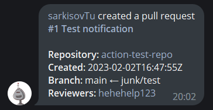

# GitHub Action Telegram

Use GitHub Action and Telegram bot to notify that pull request has been opened

# Usage

Create workflow in `.github/workflows/` and add the following code. Telegram bot token and chat id are set up as secrets in your repository

```
name: Telegram notify
on:
  pull_request:
      types: [opened, reopened]
jobs:
  build:
    runs-on: ubuntu-latest
    steps:
      - name: Check out repository
        uses: actions/checkout@v2
      - name: Send Telegram message
        uses: sarkisovTu/github-action-telegram@main
        with:
          telegramBotToken: ${{ secrets.TELEGRAM_BOT_TOKEN }}
          telegramChatId: ${{ secrets.TELEGRAM_CHAT_ID }}
          githubToken: ${{ secrets.GITHUB_TOKEN }}
```

# Showcase

